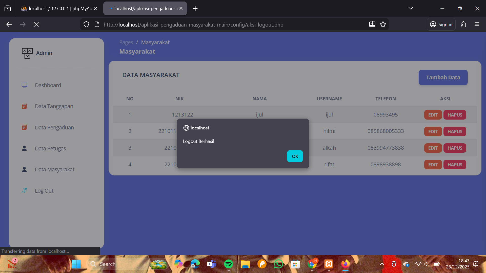
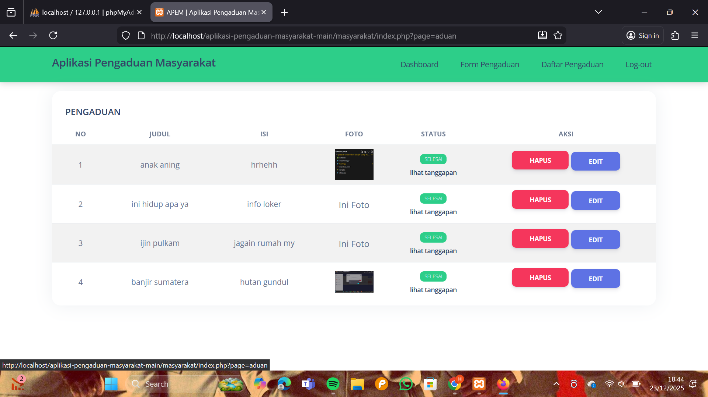

<h1 align="center">Aplikasi Pengaduan Masyarakat (APEM)</h1>

<p align="center">
Aplikasi Pengaduan Masyarakat (APEM) merupakan aplikasi web dinamis berbasis <b>PHP & MySQL</b> yang digunakan untuk menampung, mengelola, dan menindaklanjuti laporan atau pengaduan dari masyarakat secara online.
</p>

Aplikasi ini menerapkan konsep **CRUD (Create, Read, Update, Delete)** dan memiliki beberapa level akses pengguna, yaitu **masyarakat, petugas, dan admin**.

---

## 📑 Daftar Isi
- [Instalasi](#instalasi)
- [Fitur-Fitur](#fitur-fitur)
- [Screenshot Aplikasi](#-screenshot-aplikasi)
- [Download](#download)

---

## ⚙️ Instalasi

```bash
1. Download project lalu ekstrak file .zip
2. Buat database dengan nama db_apem
3. Import file db_apem.sql (tersedia di folder database)
4. Jalankan aplikasi melalui browser
5. Aplikasi Pengaduan Masyarakat siap digunakan
✨ Fitur-Fitur
✔ Menggunakan bahasa PHP, MySQL (mysqli), dan Bootstrap 5.3.2
✔ Sistem Login & Logout
✔ Fitur CRUD Data
✔ Multi-level user: Admin, Petugas, dan Masyarakat
✔ Dashboard berbeda sesuai hak akses pengguna
✔ Pengelolaan pengaduan dan tanggapan

## 📸 Screenshot Aplikasi

### 🔐 Halaman Login
Digunakan oleh masyarakat, petugas, dan admin untuk masuk ke dalam sistem.


---

### 📝 Halaman Registrasi
Digunakan oleh masyarakat untuk membuat akun baru.


---

### 🏠 Dashboard Masyarakat
Menampilkan ringkasan data dan status pengaduan masyarakat.


---

### 📤 Form Pengaduan
Digunakan masyarakat untuk mengirim laporan pengaduan beserta foto pendukung.


---

### 📋 Daftar Pengaduan Masyarakat
Menampilkan riwayat pengaduan yang pernah dikirim.


---

### 🛠️ Dashboard Admin
Menampilkan ringkasan data pengaduan, petugas, dan masyarakat.


---

### 📑 Data Pengaduan
Digunakan admin untuk mengelola pengaduan masyarakat.


---

### 💬 Data Tanggapan
Menampilkan tanggapan terhadap pengaduan masyarakat.


---

### 👥 Data Masyarakat
Digunakan admin untuk mengelola akun masyarakat.


---

### 🧑‍💼 Data Petugas
Digunakan admin untuk mengelola akun petugas.


⬇️ Download
Silakan klik tombol di bawah ini untuk mengunduh source code aplikasi dalam format .zip:

[](https://github.com/S usingaSolhMad/aplikasi-pengaduan-masyarakat/archive/main.zip)

👨‍💻 Informasi Pengembang
Nama : Hilmi Ilhamsyah
Program Studi : Teknik Informatika
Universitas : Universitas Pamulang.